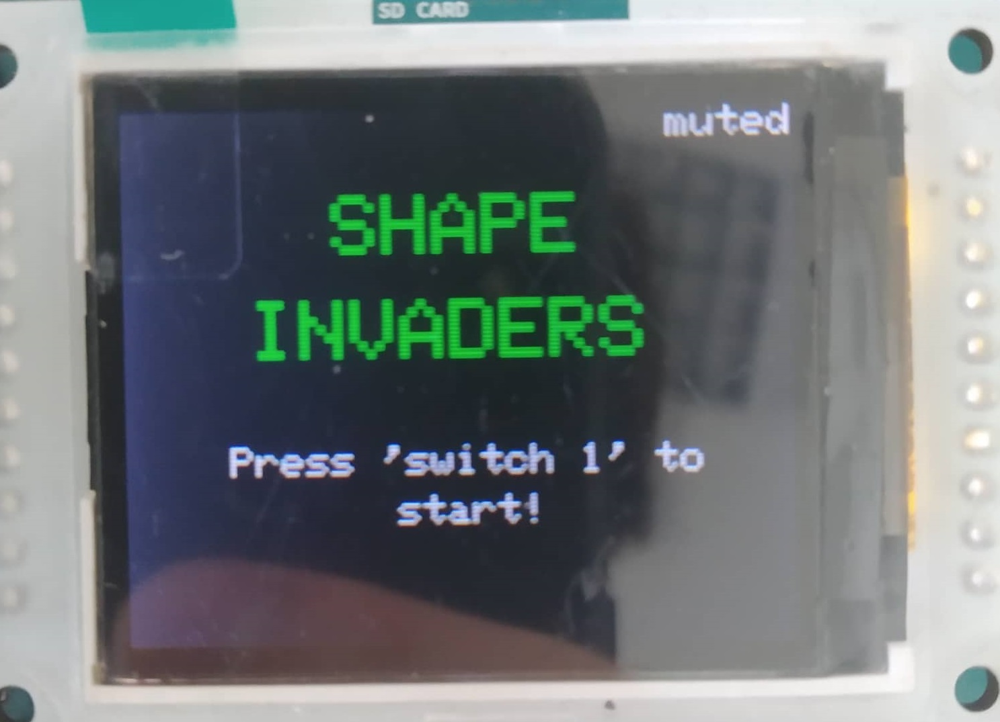
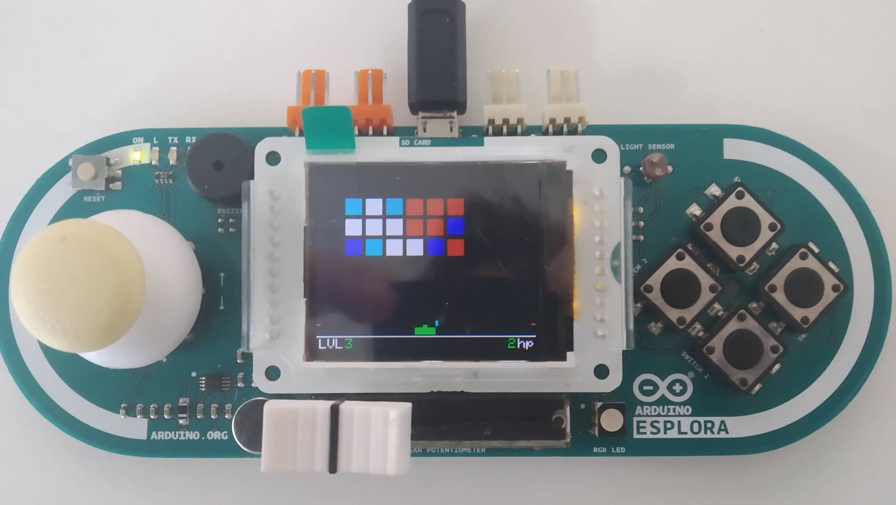

# BI-ARD - Semestrální práce

###### Zadání: Space invaders

## Specifikace

Úkolem je naprogramovat hru na princip Space Invaders na přípravek Arduino Esplora. Hra bude mít uvodní obrazovku. Po stisknutí tlačítka na úvodní obrazovce započne hra. Hráč se bude pohybovat doleva a doprava pomocí joysticku a střílet pomocí tlačítka. Z hora herní plochy se budou snášet nepřátele. Úkolem hráče je sestřelit všechny nepřátele dříve, než se dostanou dolů a nenechat se trefit střelami od nepřátrel. 

Hra je doprovázena zvukovými efekty z pieza. Bude mít 3 ůrovně se stupňující obtížností. Po dohrání hry se zobrazí vítězná obrazovka.

## Uživatelská dokumentace

#### Průběh hry
Po započnutí hry se objeví herní plocha kde se v horní části obrazovky zobrazí nepřátelé, kteří postupně sestupují dolů. V dolní části se zobrazí tank hráče a pod ním jeho životy a aktuální úroveň hry. 
Tank má za úkol sestřelit všechny sestupující nepřátele. Nepřátele mohou mít také více životů (v rozmezí 1-12) a různou kadenci střelby podle úrovně. Typ nepřátel se liší podle jejich barvy. Tank může střílet pouze po jedné střele. Let střely končí po jejím nárazu do nepřítele, nebo do okraji obrazovky.
Úroveň končí po zničení včech nepřátel, nebo po zničení tanku. Hra obsahuje 3 úrovně se zvyšující se obtížností.

#### Ovládání
Na úvodní obrazovce jde zapnout a vypnout zvukové efekty (značeno pomocí textu 'muted' v pravém horním rohu). Hra se spustí tlačítkem 'switch_1'.

Hráč se ve hře pohybuje svým tankem doleva a doprava pomocí joysticku a střílí pomocí tlačítka 'switch_1'. Hra jde kdykoliv v průběhu hry restartovat pomocí tlačítka 'switch_3'.

Hra obsahuje i **cheat** který se aktivuje v průběhu hry zmáčknutím zároveň tlačítek 'joystick_button' a 'switch_4'. Toto umožní přeskočit z aktuální úrovně na další.