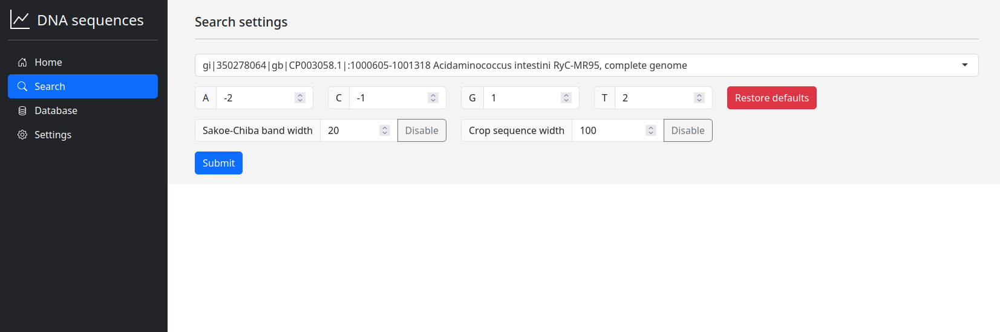
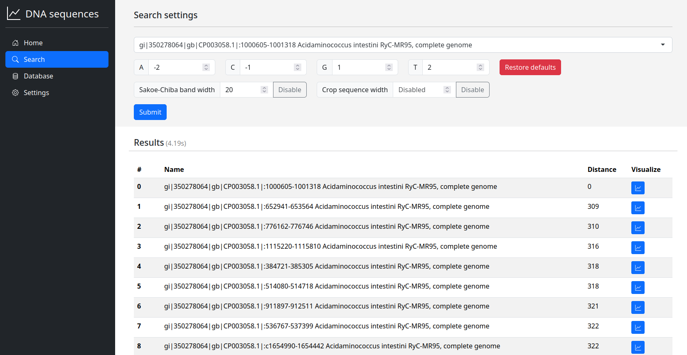
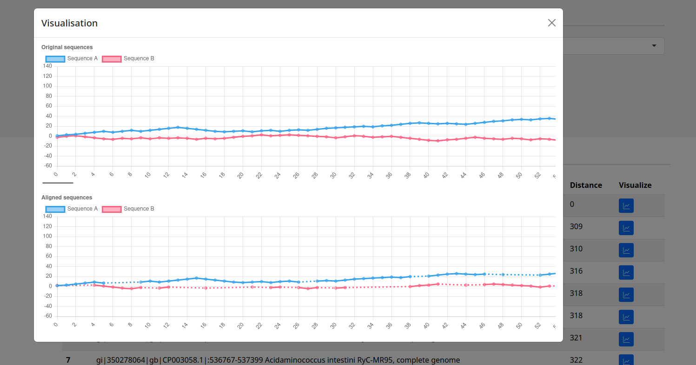
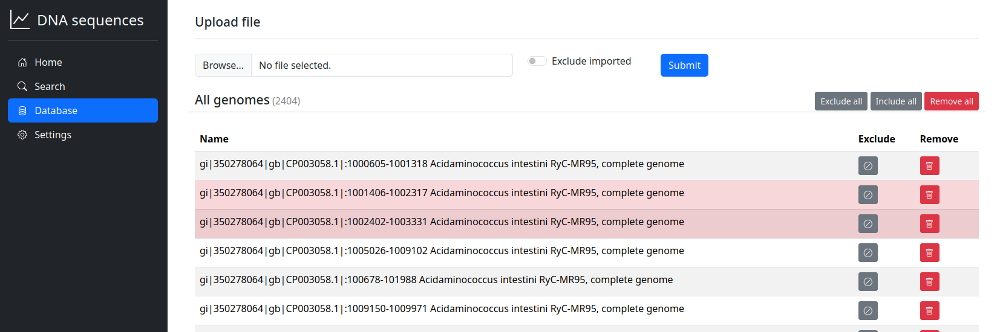
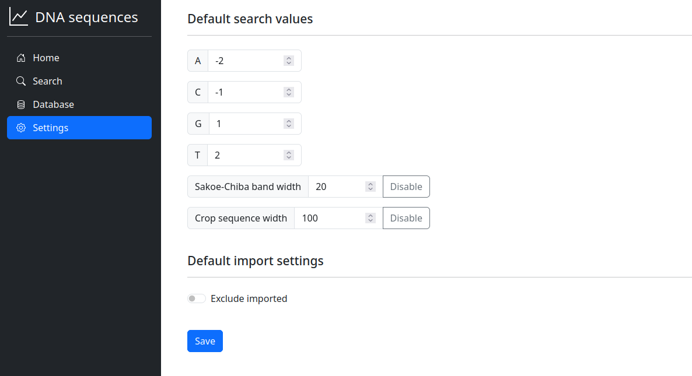
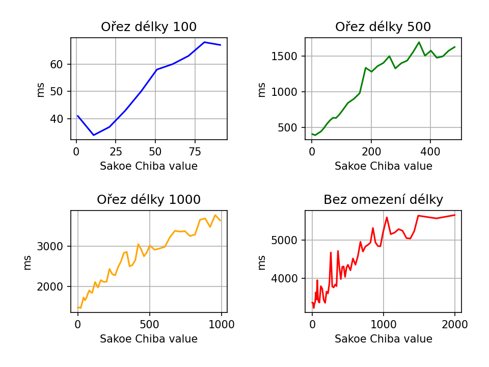
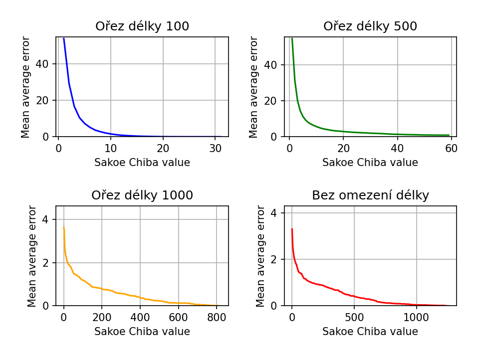
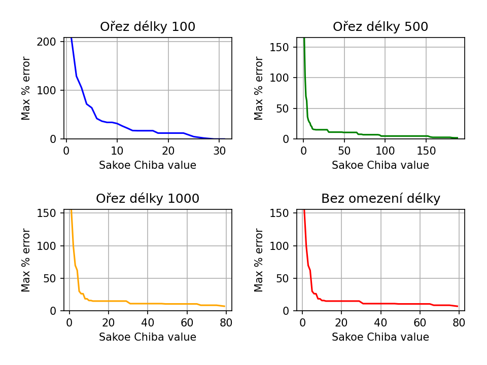
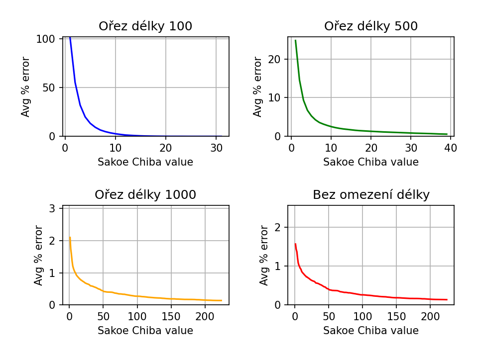

# Zarovnávání DNA sekvencí převedených na časové řady

Autor: Leoš Tobolka

## Popis projektu

Projekt se zaměřuje na hledání vzájemně podobných DNA sekvencí. Využívá algoritmus DTW (Dynamic Time Warping) k určení jejich podobnostní vzdálenosti.

Uživatel má možnost nahrát soubory s DNA sekvencemi, porovnávat je a získávat jejich podobnostní vzdálenost. Součástí výstupu je i vizuální zobrazení porovnání dvou sekvencí, ukazující mapování jedné sekvence na druhou.

## Způsob řešení

Pro porovnání jednotlivých dvojic sekvencí se využívá algoritmus DTW, který je známý svou schopností porovnávat časové řady. DNA sekvence lze snadno převést na časové řady, stačí pouze přiřadit jednotlivým nukleovým bazím (A, C, G, T) odpovídající čísla. Například (A = -2, C = -1, G = 1, T = 2).

DTW algoritmus "mapuje" dvě časové řady tak, aby co nejlépe odpovídaly jedna druhé. Jednotlivé segmenty časové řady jsou upravovány, aby co nejlépe korespondovaly s řadou druhou a naopak. Tento postup umožňuje porovnávat i časové řady různých délek.

Princip DTW algoritmu spočívá ve vytvoření matice o rozměrech N x M (N = délka první řady, M = délka druhé řady), kde jednotlivé prvky jsou spočítány jako rozdíly absolutních hodnot prvků časových řad a předchozích prvků v této matici. Tento algoritmus využívá dynamického programování. Po naplnění celé matice je v jejím posledním prvku (v pravém dolním rohu) obsažena výsledná vzdálenost mezi zkoumanými časovými řadami. Backtrackingem lze získat optimální mapování časových řad na sebe.

Implementace algoritmu je rozšířena o Sakoe-Chiba optimalizačí techniku. S jejím využití oblast prohledávání není celá matice, ale pouze pás konstantní šířky okolo diagonály. Šířka tohoto pásu závisí na vstupním parametru.

Více o algoritmu např. na https://en.wikipedia.org/wiki/Dynamic_time_warping[wikipedii].

## Implementace

Webová aplikace je napsána v programovacím jazyku Java s využitím frameworku Spring Boot. Pro ukládání DNA sekvencí slouží DBMS Postgres. K usnadnění vývoje jsem využil technologii Docker ke kontejnerizaci databáze. Pro spuštění aplikace na lokálním stroji je potřeba JDK verze 21 a Apache Maven pro instalaci aplikace a všech specifikovaných závislostí uvedených v souboru pom.xml. Dále jsou využity JavaScriptové a CSS knihovny Bootstrap 5 a Chart.js.

Adresa a přihlašovací údaje k databázi jsou specifikovány v souboru `application.properties`. Aktuální údaje jsou nastaveny tak, aby odpovídaly kontejnerizované databázi. Pokud databáze neobsahuje požadované schéma, aplikace se při spuštění automaticky postará o jeho vytvoření.

##  Příklad vstupu/výstupu

### Natavení vyhledávání

Ve vyhledávači lze zvolit DNA sekvenci, podle které chceme vyhledávat, nastavení hodnot přiřazeným k nukleovým bázím, šířku Sakoe-Chiba pásu a maximální délku na kterou ořezat jednotlivé sekvence.

### Výsledek vyhledávání

Výsledek vyhledávání je seznam DNA sekvencí seřazený vzestupně podle vzdálenosti od vyhledávané sekvence. U každého výsledku je tlačítko na zobrazení vizualizaci zarovnání dané sekvence a vyhledávané sekvence.

### Vizualizace zarovnání

Vizualizace obsahuje dva grafy, které zobrazují DNA sekvence převedené na časové řady. První graf ukazuje původní sekvence před zarovnáním pomocí DTW algoritmu. Druhý graf zobrazuje sekvence po zarovnání. Přerušovaná čára na grafu naznačuje místa, kde byly sekvence natáhnuty.

### Správa DNA sekvencí v databázi

Na této stránce lze vybrat a nahrát soubor typu .ffn, který bude importován do databáze. Dále je seznam všech DNA sekvencí, které databáze obsahuje. Jednotlivé sekvence lze vyloučit nebo smazat. Vyloučení slouží k tomu, aby se sekvence nebrali v potaz při vyhledávání. Vyloučené sekvence jsou označeny červeně. Smazáním se sekvence kompletně odstraní z databáze.

### Nastavení výchozích hodnot

Na této stráce lze nastavit výchozí hodnoty vyhledávání a importu. Tyto hodnoty se předvyplní vždy při načtení daných stránek.

## Experimentální sekce

Pro testování jsem použil sadu `CP003058.ffn`, která obsahuje 2404 prvků. Nejdelší sekvence má 7737 znaků a nejkratší 123. Průměrná délka sekvence je 894 +- 622 SD (směrodatná odchylka).

Každé měření zahrnuje čtyři grafy, přičemž se liší v délce ořezu sekvencí. Ořez délky 100 znamená, že všechny porovnávané sekvence byly zkráceny na maximální délku 100 znaků. Toto platí analogicky i pro ořezy délky 500 a 1000. Čtvrtý graf zobrazuje sekvence v jejich původní nezkrácené podobě, bez omezení délky. Všechny grafy ukazují závislost výsledku vyhledávání s hodnotou Sakoe-Chiba parametru.

Měření proběhlo na osobním počítači, proto výsledky mohou být lehce ovliněny ostatní zátěží na CPU, která v době měření nastala. Měřeno na CPU  _Intel® Core™ i7-1185G7_.

### Průměrná doba běhu

Průměrná doba běhu byla měřena z 5 náhodně vybraných DNA sekvencí. Pro každou sekvenci bylo spuštěno vyhledávání a z výsledých časů byl vypočítán průměr.

### Mean absolute error

Experiment proběhl na 30 náhodně vybraných sekvencích. Pro každou sekvenci bylo spuštěno vyhledávání mezi ostatními vybranými sekvencemi. Pro každé vyhledávání byl vypočítán Mean absolute error z výsledků bez Sakoe Chiba optimalizace a s optimalizací.

[stem]
++++
MAE = (1 / n) * Σ |predicted_i - actual_i|

++++

predicted_i :=  Vzdálenost bez Sakoe Chiba optimalizace

actual_i := Vzdálenost se Sakoe Chiba optimalizací

### Maximální procentuální chyba

Byla provedena podobná analýza jako u Mean absolute error, avšak tentokrát s využitím funkce Max%err.

[stem]
++++
Max%err = max(|actual_i - predicted_i| / {predicted_i} * 100)
++++

### Průměrná procentuální chyba

Byla provedena podobná analýza jako u Mean absolute error, avšak tentokrát s využitím funkce Avg%err.

[stem]
++++
Avg%err = (1 / n) * Σ (|actual_i - predicted_i| / {predicted_i} * 100)
++++

## Diskuze

Z experimentu je patrné, že časová náročnost roste lineárně s velikostí Sakoe-Chiba parametru, zatímco chybovost DTW algoritmu z počátku vždy exponencionálně konverguje s rostoucím Sakoe-Chiba parametrem. Jedná se tedy o efektivní optimalizační techniku. Stále se ale jedná o kvadratický algoritmus, kterému s rostoucí sadou dat bude exponencionálně stoupat časová náročnost.

Podstatného zlepšení by šlo dosáhnout paralelizací výpočtu. Vzhledem k tomu, že se DTW algoritmus při vyhledávání aplikuje na každou dvojici sekvencí a nepotřebuje při tom přistupovat ke sdílené paměti, jednalo by se o relativně jednoduchou úpravu.

Dalšího zrychlení by šlo dosáhnout optimalizací kódu. Např. optimalizací dotazů do databáze, které v některých případech dotazují nadbytečné data, nebo se zbytečně opakují.

## Závěr
Cílem práce bylo aplikování DTW algoritmu na porovnávání DNA sekvencí. K tomu účelu vznikla webová aplikace, která umožňuje vizualizovat DNA sekvence jako časové řady a spočítat jejich vzdálenost pomocí DTW. Implementována byla klasická, plně kvadratická verze algoritmu s možností Sakoe-Chiba optimalizace. Optimalizace se ukázala jako efektivní a jednoduchý princip jak zrychlit výpočet, avšak s možnou ztrátou přesnosti výsledku.
